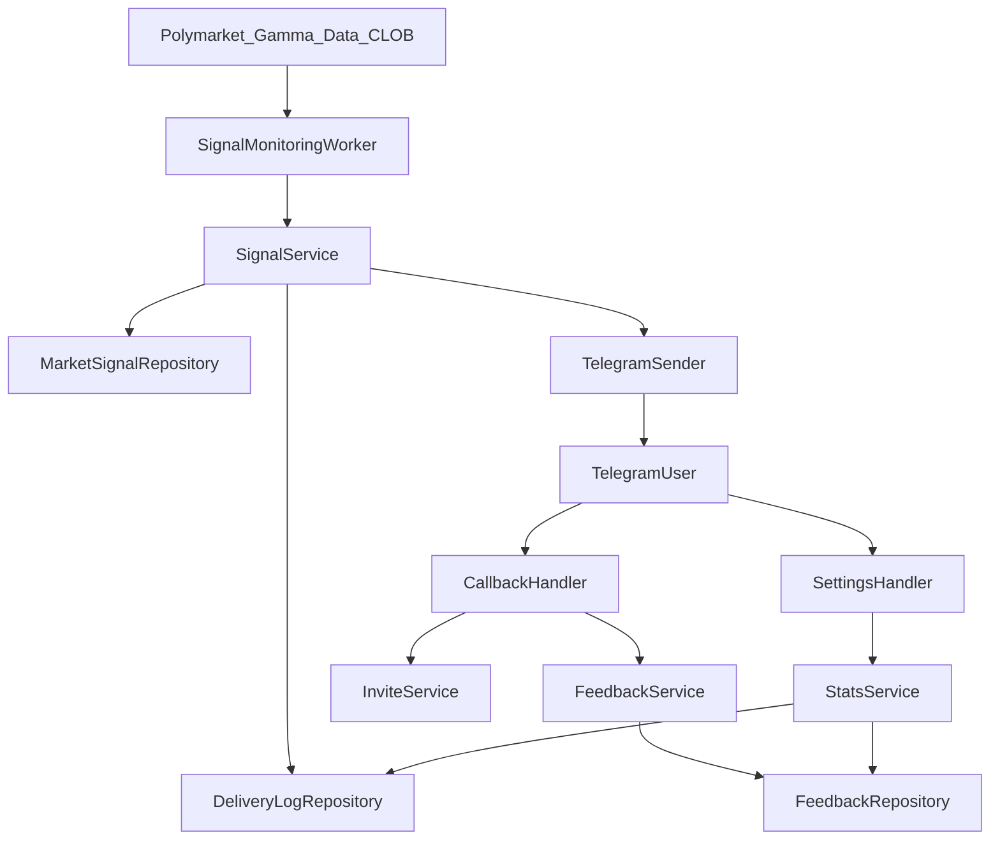

# Спецификация MVP Telegram-бота Polymarket Signals

## 1. Цель и контекст

Документ фиксирует требования для реализации MVP Telegram-бота `Polymarket Signals` на базе [Product Card](/Users/vladislavmusikhin/vibebuilding/Docs/product/Product%20Card.md) и продуктовых ограничений из [pitch-and-conversion-strategy](/Users/vladislavmusikhin/vibebuilding/Docs/product/development.strategy/pitch-and-conversion-strategy.md).

MVP фокусируется на одной ценности: быстрые `live`-уведомления о whale-size размещениях в выбранных категориях рынков Polymarket.

## 2. Границы MVP

### 2.1 In Scope

- Онбординг через `/start` по утвержденному сценарию.
- Выбор категорий: `Politics`, `Crypto`, `Sports`, `All`.
- Получение live whale-alert сигналов по выбранным категориям (отдельного «тестового» алерта по кнопке нет — первое сообщение в таком же формате приходит из мониторинга).
- Кнопки фидбека в сигнале: `Полезно`, `Не полезно`.
- Кнопка `Поделиться с другом` как инвайт в бота через deep-link.
- Кнопка `Главное меню` для возврата на стартовый экран навигационно (без сброса подписок).
- Экран `/settings` с:
  - изменением категорий,
  - статусом подписки на сигналы,
  - мини-метрикой пользы: `Получено сигналов: N`, `Отмечено полезными: M`.

### 2.2 Out of Scope (в следующую итерацию)

- Paywall и биллинг.
- Реферальные начисления и redeem-механика.
- Grade/portfolio фильтры и расширенный скоринг трейдеров.
- Watchlist и отдельные подписки на конкретные рынки.
- Расширенные режимы mute/расписаний уведомлений.
- Локализация времени под часовой пояс пользователя.
- Delayed free digest (топ за вчера) и периодические отчеты.

## 3. Пользовательские сценарии

1. Пользователь вызывает `/start`.
2. Видит value proposition и кнопки `Активировать` / `Как это работает`.
3. После активации выбирает категории.
4. Получает подтверждение: подписка включена, дальше — только живые алерты при срабатывании порога.
5. При live-сигнале может:
   - отметить полезность,
   - поделиться инвайтом в бота.
6. На любом из экранов, кроме самого `/start`, может нажать `Главное меню` и вернуться к стартовому выбору.
7. В `/settings` управляет категориями и видит персональную статистику полезности.

По кнопке `Как это работает` с `/start`: отдельный экран с пояснением и кнопками `Активировать` / `Главное меню` (без демо-алерта).

## 4. Функциональные требования

## FR-1 Онбординг

- Бот должен поддерживать сценарий из Product Card с сохранением основных текстов и сценарных шагов; допускается добавление навигационной кнопки `Главное меню`.
- После выбора категорий настройки пользователя сохраняются и применяются к live-потоку.

## FR-2 Категории сигналов

- Пользователь может выбрать одну или несколько категорий.
- Выбор `All` трактуется как подписка на все доступные категории.
- Изменение категорий через `/settings` вступает в силу сразу.

## FR-3 Генерация whale-alert

- Сигнал создается при выполнении порога whale `>= 100000 USD` (конфигурируемо через env).
- Сообщение сигнала содержит:
  - рынок,
  - платформу,
  - сторону,
  - размер,
  - цену,
  - время UTC,
  - критерий whale,
  - категорию.

## FR-4 Фидбек

- В каждом сигнале есть кнопки `Полезно` и `Не полезно`.
- Нажатие записывается как событие обратной связи с идентификатором пользователя и сигнала.

## FR-5 Поделиться с другом

- В сигнале доступна кнопка `Поделиться с другом`.
- По нажатию открывается Telegram share с предзаполненным текстом:
  - `Я использую Whale Signals Bot для алертов по крупным ставкам на Polymarket.`
  - `Если хочешь, подключайся: https://t.me/<bot_username>?start=invite_<user_id>`
- На MVP ссылка используется как инвайт на старт бота без финансовой реферальной логики.

## FR-6 /settings и метрика пользы

- В `/settings` бот показывает:
  - `Твоя статистика`
  - `Получено сигналов: N`
  - `Отмечено полезными: M`
- Расчет:
  - `N` — count доставленных live-сигналов пользователю (all-time).
  - `M` — count нажатий `Полезно` (all-time).

## FR-7 Кнопка `Главное меню`

- Кнопка `Главное меню` отображается на экранах пользователя:
  - `CategorySelection`,
  - `ActivationSuccess`,
  - `HowItWorks`,
  - `LiveAlert`,
  - `Settings`.
- По нажатию пользователь возвращается на стартовый экран (`/start`) и видит “главное меню” с кнопками `Активировать` / `Как это работает`.
- Состояние пользователя не сбрасывается:
  - выбранные категории и включенный/выключенный live-режим сохраняются;
  - главное меню действует только как навигация.
- Реализация через `callback_data="main_menu"` (или эквивалентный обработчик), обработка должна быть идемпотентной.

## 5. Нефункциональные требования

## NFR-1 Производительность и доставка

- Целевое время от появления валидного события до отправки сообщения пользователю: до 60 секунд в нормальном режиме.
- Поддержка retry при временных ошибках Telegram API и внешних API.

## NFR-2 Надежность

- Дедупликация сигналов: один и тот же сигнал не отправляется одному пользователю повторно.
- Идемпотентная обработка callback-событий кнопок.

## NFR-3 Наблюдаемость

- Структурированные логи по слоям `handlers -> services -> repositories`.
- Обязательный контекст в логах: `user_id`, `signal_id`, `update_id` (где применимо).
- Healthcheck endpoint/process probe для состояния polling-воркера.

## NFR-4 Безопасность и конфигурация

- Все секреты хранятся только в переменных окружения.
- Токен бота не логируется.
- Конфигурация порогов и интервалов опроса вынесена в `.env`.

## 6. Техническая архитектура MVP

Архитектурный стиль: согласно [Docs/ARCHITECTURE.md](/Users/vladislavmusikhin/vibebuilding/Docs/ARCHITECTURE.md), слои `handlers -> services -> repositories`.

### 6.1 Компоненты

- `Telegram Polling Bot`:
  - принимает updates,
  - маршрутизирует команды и callback.
- `Signal Monitoring Worker`:
  - опрашивает Gamma/Data/CLOB API,
  - нормализует события,
  - применяет whale-критерий и категорийную классификацию.
- `Repositories`:
  - хранение пользователей, подписок, сигналов, доставок, фидбека.

### 6.2 Data Flow



### 6.3 Режим запуска

- MVP режим: `polling + один процесс + один worker`.
- Масштабирование и переход на webhook/очереди — в Этап 2.

## 7. Интеграции и контракты

## 7.1 Внешние API (Polymarket)

- `Gamma API`: рынки, события, теги.
- `Data API`: активность/трейды для вычисления whale-событий.
- `CLOB API`: контекст цены/ликвидности и валидации рыночных данных.

## 7.2 Внутренние контракты (логические)

- `NormalizedTradeEvent`
  - `eventId`
  - `marketId`
  - `category`
  - `side`
  - `sizeUsd`
  - `price`
  - `timestampUtc`
- `WhaleSignal`
  - `signalId`
  - `normalizedEventId`
  - `thresholdUsedUsd`
  - `messagePayload`
- `FeedbackEvent`
  - `feedbackId`
  - `signalId`
  - `userId`
  - `reaction` (`helpful` | `not_helpful`)
  - `timestampUtc`

## 8. Модель данных

- `User`
  - `id`, `telegramUserId`, `createdAt`, `isActive`.
- `SubscriptionPreferences`
  - `userId`, `categories`, `isLiveEnabled`, `updatedAt`.
- `MarketSignal`
  - `id`, `marketId`, `category`, `sizeUsd`, `price`, `side`, `timestampUtc`, `rawSourceRef`.
- `DeliveryLog`
  - `id`, `signalId`, `userId`, `deliveredAt`, `status`.
- `FeedbackEvent`
  - `id`, `signalId`, `userId`, `reaction`, `createdAt`.

## 9. Wireframes (ASCII-драфты)

## 9.1 Start

```text
+--------------------------------------+
| Whale Signals Bot                    |
|                                      |
| Лови уведомления о whale-size ...    |
| Сигнал приходит в Telegram сразу...  |
|                                      |
| Готов включить сигналы?              |
|                                      |
| [Активировать] [Как это работает]    |
+--------------------------------------+
```

## 9.2 CategorySelection

```text
+--------------------------------------+
| Выбери, что тебе сейчас важнее.      |
|                                      |
| [Politics] [Crypto]                  |
| [Sports]   [All]                     |
| [Главное меню]                        |
+--------------------------------------+
```

## 9.3 ActivationSuccess

```text
+--------------------------------------+
| Готово. Подписка на категории ...    |
| Как только пройдёт крупное ...       |
| Пороги и категории — /settings       |
|                                      |
| [Изменить категории]                 |
| [Главное меню]                        |
+--------------------------------------+
```

## 9.4 HowItWorks

```text
+--------------------------------------+
| Как это работает                     |
| (краткое описание мониторинга ...)   |
|                                      |
| [Активировать]                       |
| [Главное меню]                       |
+--------------------------------------+
```

## 9.5 LiveAlert

```text
+--------------------------------------+
| Whale Alert: крупное размещение      |
| Рынок: Will [event] by [date]?       |
| Сторона: BUY YES                     |
| Размер: $245,000                     |
| Цена: 0.61                           |
| Время: 14:32 UTC                     |
| Критерий whale: >= $100k             |
| Категория: Politics                  |
|                                      |
| [Полезно] [Не полезно]               |
| [Поделиться с другом]                |
| [Главное меню]                        |
+--------------------------------------+
```

## 9.6 Settings

```text
+--------------------------------------+
| Настройки                            |
| Категории: Politics, Crypto          |
| Статус сигналов: Включены            |
|                                      |
| Твоя статистика                      |
| Получено сигналов: N                 |
| Отмечено полезными: M                |
|                                      |
| [Изменить категории]                 |
| [Выключить сигналы]                  |
| [Главное меню]                        |
+--------------------------------------+
```

## 9.7 Таблица переходов

| Откуда | Действие | Куда |
|---|---|---|
| Start | `Активировать` | CategorySelection |
| Start | `Как это работает` | HowItWorks |
| HowItWorks | `Активировать` | CategorySelection |
| CategorySelection | Выбор категории | ActivationSuccess |
| ActivationSuccess | `Изменить категории` | CategorySelection |
| LiveAlert | `Полезно`/`Не полезно` | LiveAlert (подтверждение callback) |
| LiveAlert | `Поделиться с другом` | TelegramShare |
| Любой экран | `/settings` | Settings |
| Любой экран (кроме `/start`) | `Главное меню` | Start |

## 10. Риски MVP и меры

1. Качество CLOB/сырых данных:
   - риск: неверная интерпретация размера сделки или side.
   - мера: слой нормализации + флаги неуверенности + тесты edge-case.
2. Дубликаты/ложные сигналы:
   - риск: спам и потеря доверия.
   - мера: дедуп по `normalizedEventId` и окну времени.
3. Ограничения Telegram API:
   - риск: задержки доставки и ошибки отправки.
   - мера: rate-limit aware retry, очередь отправки в памяти.
4. Низкая perceived value:
   - риск: пользователь не понимает пользу.
   - мера: понятное «Как это работает», живой первый сигнал, кнопки фидбека, метрика `N/M` в `/settings`.

## 11. Этапность после MVP

- Этап 2:
  - webhook + очередь/воркеры;
  - расширенный data-quality слой и контекст сигналов;
  - watchlist и улучшенная деградация сценариев.
- Этап 3:
  - paywall и подписки;
  - delayed free digest;
  - redeem/referral и advanced filters.

## 12. Тест-план и приемка

## 12.1 Минимальный тест-план

- Unit:
  - классификация категорий,
  - порог whale,
  - дедупликация сигналов.
- Integration:
  - `/start` -> выбор категорий -> подтверждение без демо-алерта,
  - доставка live-сигнала,
  - запись фидбека `Полезно/Не полезно`,
  - формирование share-инвайта.
- Smoke:
  - `/settings` отображает категории и метрику `N/M`.

## 12.2 Критерии приемки MVP

- Пользователь проходит онбординг без ошибок.
- Пользователь получает live-сигнал по своей категории.
- Фидбек и метрики корректно сохраняются и отображаются.
- Кнопка `Поделиться с другом` открывает share с deep-link на бота.
- Кнопка `Главное меню` возвращает на стартовый экран.
- Система не шлет дубли одного сигнала одному пользователю.
