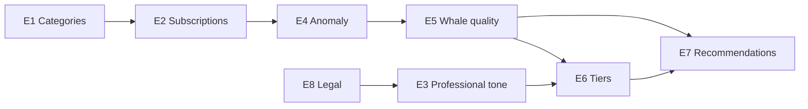

# Product Change Plan v1 — по решенческому интервью с Дмитрием

**Версия:** 1.1  
**Дата:** 2026-05-28  
**Статус реализации обновлён:** 2026-06-09 (после `c34b394` bet analytics + `8c6ca22` docs)  
**Источник:** [dmitry-solution-interview-analysis-2026-05-28.md](./dmitry-solution-interview-analysis-2026-05-28.md)  
**Транскрипт:** [archive/transcripts/dmitry-solution-interview-transcript-2026-05-28.txt](./archive/transcripts/dmitry-solution-interview-transcript-2026-05-28.txt)

---

## 0. Цель плана

Перевести инсайты решенческого интервью в **исполняемый backlog**: epics → user stories → acceptance criteria, с привязкой к спринтам, метрикам и рискам.

**North Star для этого цикла:** продукт воспринимается не как «лента крупных сделок», а как **контролируемый поток интерпретированных сигналов**, за который есть смысл платить повторно.

---

## 1. Принципы (не нарушать при реализации)

| # | Принцип | Откуда в интервью |
|---|---------|-------------------|
| P1 | Платная ценность — **потоковая аналитика**, не разовый «unlock кита» | value leakage, tiers |
| P2 | Категории и подписки должны быть **прозрачны и управляемы** | «на что подписан», гранулярность |
| P3 | Частота уведомлений — **настраиваемая**; дефолт не должен раздражать | digest / instant, ADHD-контекст |
| P4 | Win rate без контекста **не показывать** как главный сигнал доверия | whale quality model |
| P5 | Тон и визуал — **professional**, без «мемного» AI-образа | доверие к картинке кита |
| P6 | Legal/ethical: без «инсайдерской информации»; дисклеймеры и responsible UX | legal + лудомания |

---

## 2. Карта epics и спринты

| Sprint | Epic ID | Название | Приоритет | Статус |
|--------|---------|----------|-----------|--------|
| 1 | E1 | Категории и фильтры v2 | P0 | **Partial** |
| 1 | E2 | Центр подписок и доставки | P0 | **Open** |
| 1 | E3 | Professional tone (копирайт + карточка алерта) | P0 | **Partial** |
| 2 | E4 | Signal quality layer (аномальность) | P1 | **Partial** |
| 2 | E5 | Whale quality score v1 | P1 | **Partial** |
| 2 | E6 | Tier packaging (Free / Pro preview) | P1 | **Partial** |
| 3 | E7 | Whale recommendations («кого смотреть») | P2 | **Open** |
| 3 | E8 | Responsible use & legal framing | P2 | **Open** |
| 3 | E9 | Multi-source aggregation (исследование) | P2 | **Open** |

**Легенда:** **Done** — AC закрыты; **Partial** — есть в `main`, но не все AC; **Open** — не начато.

### 2.1 Сводка по stories

| Story | Статус | Коммит / примечание |
|-------|--------|---------------------|
| E1.1 | **Done** | multi-select в main до bet analytics |
| E1.2 | Open | |
| E1.3 | Open | |
| E1.4 | Open | Netherlands→Sports не влит |
| E2.1–E2.3 | Open | |
| E3.1 | **Partial** | текстовые алерты; финальный UX-шаблон не зафиксирован |
| E3.2 | Open | |
| E4.1 | **Partial** | `market_baseline_service.py`, p50 + in-memory cache (`c34b394`) |
| E4.2 | **Done** | `format_anomaly_line`, тесты (`c34b394`) |
| E5.1 | **Done** | расширенный `TraderStats` (`c34b394`) |
| E5.2 | **Partial** | skill hint в Pro; правила в коде, не в `DOCUMENTATION.md` |
| E5.3 | **Partial** | имя/ссылка — `TRADER_STATS_VISIBLE_TO`; WR/PnL всем |
| E6.1 | **Partial** | [bet-analytics-vision](./bet-analytics-vision-dmitry-solution-interview.md), `PRO_USER_IDS` |
| E6.2–E6.3 | Open | |
| E7.1 | Open | |
| E8.1–E8.2 | Open | |
| E9.1 | Open | |

**Вне stories плана, но в `main` (`c34b394`):** trade context (implied %, odds bucket, flash), signal strength verdict, Free/Pro gating аналитики — см. [bet-analytics-vision](./bet-analytics-vision-dmitry-solution-interview.md).

**Уже в main (вне этого плана, но связано):** resolution follow-up, `/admin_stats` pending/resolved, фикс доставки whale/resolution, trader stats allowlist + HTML fallback.

---

## Epic E1 — Категории и фильтры v2

**Статус epic:** **Partial**

**Проблема:** широкие категории (Politics / Geopolitics / Economics) не отражают, как пользователь реально думает; Economics «тянет» политику и геополитику.

**Цель:** пользователь выбирает осмысленный набор тем без путаницы; бэкенд корректно матчит сделки.

### Story E1.1 — Мульти-выбор категорий при онбординге

**Статус:** **Done**

**Как** пользователь, **я хочу** включить несколько категорий (не только одну), **чтобы** получать сигналы по пересекающимся темам (например, Economics + Geopolitics).

**Acceptance criteria:**
- [x] После «Активировать» пользователь может выбрать **2+ категории** (toggle или multi-step), не только одну.
- [x] Сохранённый профиль хранит `categories[]` с несколькими значениями.
- [x] Whale-алерты приходят, если `category` сделки ∈ `user.categories` (логика как сейчас, но с multi-select UI).
- [x] В `/settings` отображается полный список активных категорий.

**Зависимости:** UX/UI approval (клавиатуры, тексты).  
**Метрика:** доля пользователей с ≥2 категориями; D7 retention.

---

### Story E1.2 — Подсказки при выборе категории (связанные темы)

**Статус:** **Open**

**Как** пользователь, **я хочу** видеть, что Economics часто связана с Politics/Geopolitics, **чтобы** не пропускать релевантные сигналы.

**Acceptance criteria:**
- [ ] При выборе Economics показывается короткая подсказка (1–2 строки): рекомендуется также включить Geopolitics/Politics.
- [ ] Подсказка не блокирует выбор; есть «Понятно» / можно пропустить.
- [ ] Подсказка не дублируется при каждом входе в settings (флаг «seen» или показ только при первом выборе Economics).

**UX/UI (нужно подтверждение):** тексты подсказок.

---

### Story E1.3 — Гранулярные фильтры v0 (без полной иерархии)

**Статус:** **Open**

**Как** power-user, **я хочу** сузить поток внутри Politics/Geopolitics (например, US / EU / Middle East), **чтобы** не получать весь мир.

**Acceptance criteria:**
- [ ] В settings доступен опциональный блок «Уточнить регион» для Politics и Geopolitics (минимум 3 пресета + «Все»).
- [ ] Классификатор сделок (`category_mapper` или новый слой) тегирует сделку регионом по slug/title (эвристика, документированная в коде).
- [ ] Если пользователь выбрал регион US, сделки без US-тега в Politics не доставляются.
- [ ] Если регион не выбран — поведение как сейчас (вся категория).

**Out of scope v0:** произвольные пользовательские теги; ML-классификация.

**Метрика:** снижение mute/disable_live после включения регионов (гипотеза A).

---

### Story E1.4 — Исправление ложных категорий (регрессии)

**Статус:** **Open** (eth fix был на feature-ветке; Netherlands/World Cup в `main` нет)

**Как** команда, **мы хотим** не помечать спортивные рынки как Crypto из-за подстрок в title.

**Acceptance criteria:**
- [ ] `Netherlands` + `World Cup` → Sports, не Crypto.
- [ ] Unit-тесты в `test_category_mapper.py` покрывают известные false positives.
- [ ] Документировано в `DOCUMENTATION.md`: классификация эвристическая, список known limitations.

---

## Epic E2 — Центр подписок и доставки

**Статус epic:** **Open**

**Проблема:** пользователь не видит, на что подписан; частые пуши раздражают; нет объяснения, зачем задержка vs instant.

### Story E2.1 — Экран «Мои подписки»

**Статус:** **Open**

**Как** пользователь, **я хочу** в одном месте видеть категории, статус live и режим доставки, **чтобы** не гадать, почему приходят или не приходят алерты.

**Acceptance criteria:**
- [ ] Команда `/settings` или кнопка «Мои подписки» показывает: live on/off, список категорий, режим доставки, (если есть) региональные фильтры.
- [ ] Из этого экрана можно перейти к «Изменить категории» и «Деактивировать уведомления».
- [ ] Текст явно говорит: «Сигналы приходят только по выбранным категориям».

**UX/UI (нужно подтверждение):** структура меню, формулировки.

---

### Story E2.2 — Режим доставки: Digest (free default) vs Instant (pro preview)

**Статус:** **Open**

**Как** пользователь, **я хочу** получать сводку раз в N часов вместо каждого алерта, **чтобы** Telegram не спамил.

**Acceptance criteria:**
- [ ] В профиле поле `delivery_mode`: `instant` | `digest_3h` (имя и интервал конфигурируемы).
- [ ] **Default для новых пользователей:** `digest_3h` (или согласованный интервал).
- [ ] Digest: накопление eligible алертов в очереди; одно сообщение-батч с заголовком «Сводка за 3 ч» и списком (≤N алертов, остальное «+K ещё»).
- [ ] Instant: текущее поведение worker.
- [ ] При онбординге 1–2 предложения объясняют: «Сводка каждые 3 ч, чтобы не отвлекать; моментально — в Pro».

**Технические заметки:** отдельная таблица/очередь digest_pending; cron или tick в worker.

**Метрика:** mute rate, D14 retention (гипотеза B).

---

### Story E2.3 — Quiet hours (опционально)

**Статус:** **Open**

**Как** пользователь, **я хочу** не получать уведомления ночью, **чтобы** не отключать бота полностью.

**Acceptance criteria:**
- [ ] В settings: UTC offset или выбор «тихие часы» (пресет 23:00–08:00 local).
- [ ] В quiet hours алерты буферизуются в digest или откладываются до окна.
- [ ] Пользователь видит в «Мои подписки», что quiet hours активны.

**Приоритет:** можно отложить после E2.2, если digest уже снижает шум.

---

## Epic E3 — Professional tone

**Статус epic:** **Partial**

**Проблема:** AI-картинка кита и «мемный» тон снижают доверие для платящей аудитории.

### Story E3.1 — Карточка whale-алерта без декоративного AI-визуала

**Статус:** **Partial**

**Как** пользователь, **я хочу** читать факты по сделке без отвлекающей картинки, **чтобы** доверять источнику.

**Acceptance criteria:**
- [x] В алерте нет сгенерированного изображения кита/кита-мема.
- [x] Структура полей: рынок, сторона, размер, цена, время, категория, критерий whale; опционально — компактный блок трейдера (WR/PnL) без аватара-AI.
- [ ] Единый стиль с resolution-алертом («🏁 Итог события»); после `c34b394` добавлены analytics-блоки — финальный шаблон не согласован (UX/UI).

**UX/UI (нужно подтверждение):** финальный шаблон текста.

---

### Story E3.2 — Копирайт онбординга и settings (professional)

**Статус:** **Open**

**Как** новый пользователь, **я хочу** понять ценность без hype-формулировок.

**Acceptance criteria:**
- [ ] `/start`, подтверждение категорий, `/settings` переписаны: нейтральный тон, без «инсайдерской информации».
- [ ] Есть короткий дисклеймер: не финсовет, данные публичные, риск потерь.
- [ ] Упоминание digest-режима и опции Pro (если E6 ещё не live — «скоро» или скрыто).

**UX/UI (нужно подтверждение):** все видимые строки в чате.

---

## Epic E4 — Signal quality layer (аномальность)

**Статус epic:** **Partial**

**Проблема:** размер $651k сам по себе не говорит, насколько сделка необычна для рынка.

### Story E4.1 — Baseline размера сделки по рынку/категории

**Статус:** **Partial** — `Bot/src/services/market_baseline_service.py` (`c34b394`)

**Как** аналитик продукта, **мы хотим** знать медиану/перцентиль размера сделок по `condition_id` или категории за 7–30 дней.

**Acceptance criteria:**
- [ ] Фоновый job или on-demand расчёт: `market_trade_baseline` (condition_id, p50_usd, p90_usd, sample_n, updated_at) — **сейчас:** on-demand p50, без p90 и без SQLite-таблицы.
- [x] При `sample_n < MIN` baseline не показывается (fallback: только абсолютный размер).
- [x] Данные в SQLite или in-memory cache с TTL — **сейчас:** in-memory cache, TTL 600s.

---

### Story E4.2 — Показ «аномальность» в карточке алерта

**Статус:** **Done** — `format_anomaly_line`, Free brief / Pro full (`c34b394`)

**Как** пользователь, **я хочу** видеть, что ставка в N× больше типичной для этого рынка, **чтобы** быстрее оценить значимость.

**Acceptance criteria:**
- [x] В тексте алерта строка вида: «Типичная сделка на этом рынке: ~$X; эта — $Y (≈Z× выше)» (Pro); Free — кратко «≈Z×».
- [x] Если baseline недоступен — строка скрыта, не «0×».
- [x] Unit-тест на форматирование и граничные случаи (`test_bet_analytics.py`).

**Метрика:** CTR «открыл Polymarket» / qualitative feedback в follow-up интервью.

---

## Epic E5 — Whale quality score v1

**Статус epic:** **Partial**

**Проблема:** голый win rate вводит в заблуждение (много ставок на 0.95 vs редкие сложные исходы).

### Story E5.1 — Расширенная статистика трейдера в Data API

**Статус:** **Done** — `trader_stats_service.py` (`c34b394`)

**Как** система, **мы хотим** для кошелька кита считать: число закрытых позиций, распределение entry price, средний размер, частота сделок.

**Acceptance criteria:**
- [x] Используется существующий `TraderStatsService` + доп. поля в модели stats.
- [x] Кэш TTL сохранён; не блокировать доставку алерта >2s из-за stats (timeout 8s в `signal_worker`).

---

### Story E5.2 — Whale Quality Score (отображение в алерте)

**Статус:** **Partial** — skill hint в Pro-блоке; документация в коде, не в `DOCUMENTATION.md`

**Как** пользователь, **я хочу** понять, насколько «качественен» кит, не только WR 61%.

**Acceptance criteria:**
- [x] В алерте блок «Трейдер»: WR (N закрытых), realized PnL (как сейчас), **+** 1 строка quality hint (Pro).
- [ ] Правила v1 задокументированы в `DOCUMENTATION.md`; не использовать слово «инсайдер» — правила в `bet_analytics.py`.
- [x] Если данных мало — «Недостаточно истории», не выдуманный score.

**Out of scope v1:** единый числовой grade S/A/B в UI (можно P2).

---

### Story E5.3 — Не отдавать прямую «подписку на кита» в free tier

**Статус:** **Partial** — реализовано через `TRADER_STATS_VISIBLE_TO` (имя/ссылка), не через tier

**Как** продукт, **мы защищаем** повторяющуюся ценность, **не давая** в free всё, что можно скопировать в Polymarket навсегда.

**Acceptance criteria:**
- [x] В free: **без** имени кита и deep-link на профиль (`👤 Кит: скрыт`); WR/PnL видны всем. Имя+ссылка — только `TRADER_STATS_VISIBLE_TO`.
- [ ] В Pro preview / paid: расширенный профиль + follow suggestions (см. E7) — profile link не привязан к `PRO_USER_IDS`.
- [x] Product decision зафиксирована: см. [bet-analytics-vision](./bet-analytics-vision-dmitry-solution-interview.md) § Free vs Pro.

**Открыто:** задержка 24h для free; единая модель tier vs allowlist.

---

## Epic E6 — Tier packaging (Free / Pro)

**Статус epic:** **Partial**

**Проблема:** нет явной упаковки, за что платить; trial должен показывать **повторяемую** ценность.

### Story E6.1 — Матрица возможностей Free vs Pro (документ + конфиг)

**Статус:** **Partial** — [bet-analytics-vision](./bet-analytics-vision-dmitry-solution-interview.md), `PRO_USER_IDS`, `TierService`

**Как** команда, **мы хотим** единый source of truth для gating.

**Acceptance criteria:**
- [x] Таблица в `Docs/product/` — [bet-analytics-vision](./bet-analytics-vision-dmitry-solution-interview.md).
- [ ] Минимум: категории (лимит), delivery (digest vs instant) — **аналитика** gating есть; digest/instant — нет.
- [x] Флаги в `config.py` — `PRO_USER_IDS`, `BET_ANALYTICS_*`; **нет** `user.tier` в БД.

---

### Story E6.2 — Pro preview в боте (без платёжки)

**Статус:** **Open**

**Как** пользователь free, **я хочу** увидеть пример Pro-алерта, **чтобы** понять апгрейд.

**Acceptance criteria:**
- [ ] В `/settings` или после N алертов — одно сообщение «Пример Pro-сигнала» с mock или реальным алертом + пометкой полей, доступных в Pro.
- [ ] CTA: «Хочу Pro» → сбор waitlist (форма / ссылка / запись в SQLite `pro_waitlist`).
- [ ] Не обещать цену без согласованного WTP-теста ($15–20 гипотеза из solution script).

---

### Story E6.3 — Trial design (продуктовая спецификация)

**Статус:** **Open**

**Как** PM, **я хочу** описать trial так, чтобы не провоцировать лудоманию и показать ROI.

**Acceptance criteria:**
- [ ] Документ: длительность trial, лимит алертов/день, обязательный digest в trial или opt-in instant.
- [ ] Критерий успеха trial: пользователь получил ≥X digest с ≥Y «аномальных» сигналами и оценил полезность (микро-опрос 1–5).
- [ ] Не отправлять Дмитрию «2 недели ежедневных пушей» без согласия — учесть его feedback.

---

## Epic E7 — Whale recommendations

**Статус epic:** **Open**

### Story E7.1 — Еженедельная подборка «Киты недели» (digest special)

**Статус:** **Open**

**Как** Pro-пользователь, **я хочу** раз в неделю список 3–5 аккаунтов с кратким обоснованием, **чтобы** не искать самому.

**Acceptance criteria:**
- [ ] Раз в 7 дней job отбирает китов по правилам (WR adjusted, min N, не только 0.99 entries).
- [ ] Сообщение отдельным типом `weekly_whale_digest`; не смешивается с trade alerts.
- [ ] Free: teaser (1 кит + «ещё 4 в Pro»).

---

## Epic E8 — Responsible use & legal

**Статус epic:** **Open**

### Story E8.1 — Дисклеймеры в боте

**Статус:** **Open**

**Acceptance criteria:**
- [ ] `/start` и footer алерта: не инвестсовет; публичные данные; риск потерь; 18+ где уместно.
- [ ] Нет формулировок «инсайдерская информация» / «гарантированная прибыль».

**UX/UI approval:** тексты.

---

### Story E8.2 — «Пауза уведомлений» и лимит частоты

**Статус:** **Open**

**Acceptance criteria:**
- [ ] Кнопка «Пауза на 24ч / 7 дней» в settings (не полное disable_live, если пользователь хочет вернуться).
- [ ] Опциональный hard cap: max instant alerts per day для free (конфиг).

---

## Epic E9 — Multi-source aggregation (discovery)

**Статус epic:** **Open**

### Story E9.1 — Research spike: Kalshi + др.

**Статус:** **Open**

**Acceptance criteria:**
- [ ] Документ 2–3 стр.: API, legal, overlap с PM audience, effort estimate.
- [ ] Решение go/no-go для MVP+1.

**Не блокирует** E1–E6.

---

## 3. Зависимости между epics

---

## 4. Метрики успеха (на 6–8 недель)

| Метрика | Baseline | Target | Связь |
|---------|----------|--------|--------|
| D7 retention | TBD | +X% | E1, E2 |
| disable_live / mute rate | TBD | −Y% | E2 digest |
| % users with ≥2 categories | TBD | +Z% | E1.1 |
| Pro waitlist signups | 0 | N | E6.2 |
| Resolution delivered / pending | admin_stats | рост resolved при закрытых рынках | уже в prod |
| Qualitative trust (интервью) | — | «профессионально» ≥4/5 | E3 |

---

## 5. Риски и mitigations (из backlog)

| Риск | Mitigation в плане |
|------|-------------------|
| Сложный онбординг | E1.3 регионы — опционально; default «Все» |
| Value leakage | E5.3, E6 tier gating |
| Ложный WR | E5.2 quality hint, не один WR |
| Churn от пушей | E2.2 digest default |
| Legal | E8.1 |
| ASR/интервью неточности | повторное касание с Дмитрием по WTP и tier copy |

---

## 6. Out of scope (v1 плана)

- Полноценная оплата (Stripe/Telegram Payments) — после E6.2 waitlist.
- Подписка на отдельного кита как отдельный продуктовый объект — после E5/E6.
- Kalshi live integration — только E9 spike.
- Переписывание classification на ML.

---

## 7. Чеклист перед стартом спринта 1

- [x] E1.1 multi-select категорий — в `main`.
- [ ] Согласовать UX/UI тексты для E2.1, E2.2, E3 (workflow rule); E1.1 — done.
- [ ] Влить в `main` fix категории Netherlands→Sports (E1.4).
- [ ] Подтвердить default delivery: digest_3h vs instant для beta-когорты.
- [x] Зафиксировать матрицу Free/Pro черновиком (E6.1) — [bet-analytics-vision](./bet-analytics-vision-dmitry-solution-interview.md); gating аналитики в `c34b394`.

## 7.1 Рекомендуемый следующий фокус (после Sprint 2 partial)

1. **E2.2** digest default — снижение churn от пушей (P3 в интервью).
2. **E3.2 + E8.1** professional copy + дисклеймеры.
3. **E1.4** Netherlands→Sports.
4. **E4.1** довести baseline: p90, SQLite persistence (опционально).
5. **E6.2** Pro preview + waitlist.

---

## 8. Ссылки

- Анализ интервью: [dmitry-solution-interview-analysis-2026-05-28.md](./dmitry-solution-interview-analysis-2026-05-28.md)
- Скрипт решенческих интервью (ветка `cursor/docs-solution-interview-script`): `solution-interview-script.md`
- Бот: `Bot/DOCUMENTATION.md`, архитектура `Docs/ARCHITECTURE.md`
- Видение аналитики: [bet-analytics-vision-dmitry-solution-interview.md](./bet-analytics-vision-dmitry-solution-interview.md)

---

*Статусы stories в §2.1 и у каждой story обновлены 2026-06-09. Дальше — в трекере (GitHub Issues / Linear) по мере взятия в работу.*
